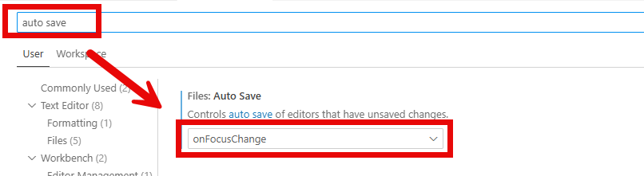
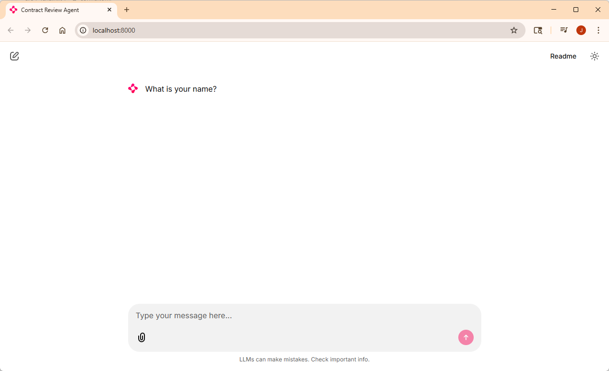

# Lab 0: Getting started

## Learning Objectives

1. Get your development environment configured
2. Get your Azure resources setup
3. Verify Chainlit is working

## Prerequisites

1. Git
2. Python 3.12 or later
3. Visual Studio Code with the Python extension installed

## Setup your development environment

1. Open a terminal window in the folder you want your workshop files to be located

2. In the terminal window clone the repository by running the following command:
```shell
git clone https://github.com/JasonHaley/agentcon-boston-workshop.git
```

3. Create a virtual environment by running the following command:
```shell
python -m venv .venv
```

4. Activate the virtual environment by running the following command:
```shell
.\.venv\Scripts\activate
```
or linux/Mac
```shell
source .venv/bin/activate
```

5. Install the required packages by running the following command:
```shell
pip install -r requirements-dev.txt
```

> NOTE: notice there is **-dev** on the end of that file. It also runs the requirements.txt file in the src directory.

6. Open VS Code for the folder by running the following command or just open VS Code with for the folder:
```shell
code .
```
7. Verify Save Change automatically is turn on for you VS Code. File -> Preferences -> Settings -> Type "auto save" in the search box. Ensure **onFocusChange** is selected,




## Configure the Azure resources

1. In VS Code, **create** a .env file in the root of the workshop folder.

2. **Add** the following to the .env file:
```shell
AZURE_DOCUMENTINTELLIGENCE_SERVICE=<doc intelligence service name>
AZURE_DOCUMENTINTELLIGENCE_API_KEY=<doc intelligence api key>

AZURE_SEARCH_ENDPOINT=<search endpoint>
AZURE_SEARCH_INDEX_NAME=<sarch index name>
AZURE_SEARCH_API_KEY=<search api key>

AZURE_OPENAI_ENDPOINT=<openai endpoint>
AZURE_OPENAI_API_KEY=<openai api key>

AZURE_OPENAI_EMBEDDING_DEPLOYMENT=text-embedding-3-large
AZURE_OPENAI_MODEL_NAME=text-embedding-3-large
EMBED_DIM=3072
AZURE_OPENAI_CHAT_DEPLOYMENT_NAME=gpt-4.1
```
3. Populate the variables with your azure resource settings.

> NOTE: For those of you in the workshop on September 27, 2025 - I will be providing you with the api keys to use predeployed Azure resources **for the day only**.

## Verify Chainlit works

[Chainlit](https://chainlit.io/) provides us with an easy to use UI without having to do all the work.

1. In VS Code, open a terminal and **change to the src** directory
```shell
cd src
```

2. Verify you are in the virtual environment, if not run the activate command above. Run the following command to verify Chainlit is ready:
```shell
chainlit hello
```
Your browser should open and you should get the UI shown below:



3. Now press Control + C to cancel out of the running Chainlit

Your development environment should now be ready to begin Lab 1

## [Go to Lab 1 >](../lab1/readme.md)