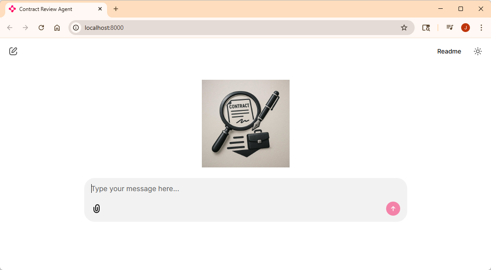
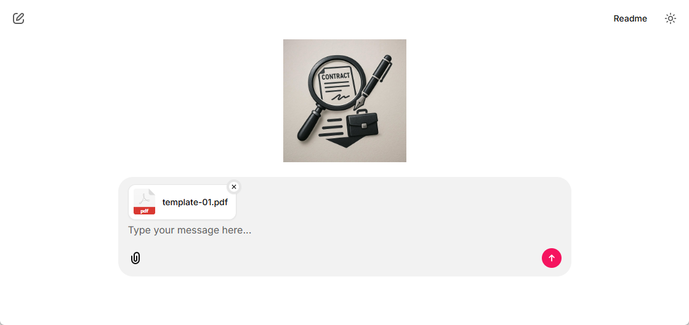
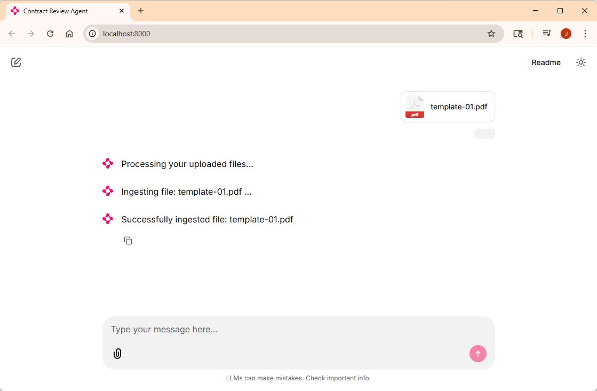

# Lab 1: Processing PDFs to be useful in RAG

## Learning Objectives

1. Parse a pdf contract file using Azure AI Document Intelligence
2. Use LangChain to split the file into clauses
3. Create metadata about the clauses and remove legal stop words
4. Create embeddings for the clauses
5. Save clauses to an Azure AI Search Index
6. Wire up Chainlit to test

## Prerequisites

1. Lab 0 is required to have the development environment configured and all dependencies installed

## High level overview of what is provided

In order for this workshop not to be the specifics about how to implement a RAG system, I have provided most of the RAG implementation. This lab should be a quick walkthrough of the pieces and adding some code that wires it together. However, I did want the lab to be provide you with a realistic scenario and useful code that resembles a real code project.


- The **config** folder: Contains a utility class that provides access to the environment variables and credentials used by the system.
- The **data** folder: Contains two sample contract pdf files.
- The **models** folder: Contains a few models used by the document parsing and processing.
- The **processors** folder: Contains the document_processor.py file, which is the main class we'll be working with in Lab 1.
- The **prompts** folder: Contains the prompts used by the agents are located
- The **public** folder: Is a Chainlit folder and contains the logo file you'll see soon
- The **reference** folder: Contains refrence files used by the system, some for data processing and others for LLM interaction
- The **services** folder: Contains the Azure, OpenAI resource and prompty interaction logic.
- The **utils** folder: Contains some utility code used during document processing.
- The **main.py** file: Is the file that contains the Chainlit event handlers and will be the place all things get wired to the UI

> NOTE: As I'm sure you are probably aware of, whitespace means something to python, so you may need to change some of the indentations when copying and pasting code.

## Parse a pdf contract file using Azure AI Document Intelligence

1. Open the src/processors/**document_processor.py** file in VS Code
2. Locate the **process_file** method (should start around line 98) and find the comment `# TODO: Parse document into pages`. Replace it with the following:
```
            # Parse document into pages
            pages = await self._extract_pages(file, filename)
            if not pages:
                raise ValueError(f"No pages extracted from {filename}")
```
This code has the internal method (right below the process_file method) _extract_pages, use the doc_intelligence service to parse the uploaded pdf and return a list of the Page class (in the models/document.py file).

The bulk of the work is performed by the DocumentIntelligenceService parse_document method (shown below):


As you can see, the document is set to be parse as markdown, then due to the way the DocumentIntelligence SDK works, you need to await a poller.result() to know when the anaysis is complete. Once the result is returned, the pages are enumerated the Page model is populated with the text and offsets.

3. Back in the **process_file** method, find the comment `# TODO: Combine all page text` and replace it with the following:
```
            # Combine all page text
            full_text = self._combine_page_text(pages)
```
This code uses the interal method _combine_page_text to aggregate all the text in the document into the `full_text` variable.

Now we have all the text from the pdf.

> ## RAG Note
> 
> When you are parsing files in order to use for a retrieval system, it is important to know what is in those documents in order to make your retrieval more effective. The old saying "Garbage in, Garbage out" applies here.
> 
> If you open the sample pdf files in the data directory, you will notice the clauses of the contract are nicely separated by headings.
> This is why we are using markdown to parse these files.
>
> We don't have any tables, figures or images in these files, but if you did - it is at this point in the project you would want to
> think through how you are going to make that data useful for a retrieval system. 

## Use LangChain to split the file into clauses

LangChain has a great text splitter that will take the PDF text and create chunks broken on the headings for us: [MarkdownHeaderTextSplitter](https://python.langchain.com/docs/how_to/markdown_header_metadata_splitter/)

1. In the **document_processor.py** file, around line 34, you can see the constant `DEFAULT_HEADERS` defined:


This will be used to configure the splitter to split on the 3rd level of markdown headers if it finds them, otherwise the 2nd and then the 1st if it doesn't find 2nd level.

2. Locate the comment `# TODO: Initialize text splitter` and replace it with the following:
```
        # Initialize text splitter
        headers = headers_to_split_on or self.DEFAULT_HEADERS
        self.markdown_splitter = MarkdownHeaderTextSplitter(
            headers_to_split_on=headers,
            strip_headers=True
        )
```
This instantiates the splitter, sets the heading levels and indicates the section headers should be stripped from the text.

> **Question**: Why am I removing the header text from the chunks?
> 
> **Answer**: This has to do with knowing the data and how we want it to be useful for retrieval. The system is going to work with clauses of the contract, we don't need the heading in that clause - so we will use it as metadata instead.

3. Again navigate to the **process_file** method and locate the comment `# TODO: Split into chunks and create clauses` and replace it with this:
```
            clauses = await self._create_clauses(full_text, filename)
            if not clauses:
                self.logger.warning(f"No clauses created for {filename}")
                return self._create_stats(filename, pages, full_text, [], [])
```
This code uses the internal method `_create_clauses` which splits the `full_text` using the markdown splitter, then uses another internal method `_create_single_clause` which populates a `Clause` model. This is also the method that populates useful metadata on the Clause model. The result ends up being a list of clauses along with meaningful metadata.


## Create metadata about the clauses and remove legal stop words

So far the PDF has been parsed as markdown and split into the contract clauses using the markdown splitter. Next what can we do in addition to just having the text chunk from pdf to help our retrieval system?

### Metadata
Metadata we can use and get from the content and context of the chunks:
- headings
- use the heading to categorize the clause
- index of the clause
- indicate if it is a template file or not

### Stop words
Another technique we can use, is the removal of legal stop words from the pdf text chunk before we calculate embeddings on the text. Stop words are common words that occur often but carry very little substantive information, removing them should "sharpen" the effectiveness of our embedding for the retrieval system.

> NOTE: we could also add the section headings to the "clean_text" to add more signal to our embedding - however I'll leave this as an exercise to the user to try out.

1. In the **document_processor.py** file, find the comment `# TODO: Extract actual header from metadata` in the `_extract_section_header` method and replace it with the following:
```
            metadata.get("Header 3") or 
            metadata.get("Header 2") or 
            metadata.get("Header 1") or 
```
The LangChain markdown splitter gives us a metadata dictionary that has the headers showing where the text chunk is nested. We want to use the first heading up - which most likely will be an level 2 heading but in some cases Document Intelligence is throwing in a level 3 heading. Now that we have the heading for the clause, we want to categorize it.

2. Find the **clause_classifier.py** file in the **utils** directory and open in.

This file contains a lot of utility text parsing and regular expression matching type code. In order to create a clause_type category we are going to use text matching. 

> NOTE: You could use a model to do the categorizing, but I'll leave that to another workshop.

3. Toward the bottom of the file, find the comment `# TODO: Apply rules to classify heading` and replace it with the following:
```
    for ctype, patterns in RULES:
        for pat in patterns:
            if pat.search(h):
                return ctype
```

This code finishes up the `classify_clause_heading` method which has 3 steps in it:
- normalize the text
- special case checking
- regex rules applying

> NOTE: If you attempt to use this code in another business domain or even want to be able process additional contracts with the final product - **you will need to modify one of these steps**. That unfortunately is the nature of text cleanup using code instead of an AI model.

4. Back in the **document_processor.py** file, in the `_create_single_clause` method, find the comment `# TODO: populate clean text properly` and replace it with this line:
```
            text_clean=clean_text(chunk.page_content, self.stopwords),
```
This line uses the `clean_text` method to remove the stopword from the text chunk from the pdf. This should improve the retrieval by cutting down some of the noise in the text.

Next, let's create those embeddings.

## Create embeddings for the clauses

1. In the **document_process.py** file, find the `_index_clauses` method and the comment `# TODO create embeddings` and replace it with the following:
```
        embeddings = await self.embedding_service.create_embeddings(texts)
```
This takes that `text_clean` field from all the clauses and makes batch calls to the OpenAI embedding service to minimize the number of calls.

## Save clauses to an Azure AI Search Index

1. A couple of lines below where you put the last code, find the comment `# TODO upload to search index` and replace it with the following:
```
        await self.search_service.upload_clauses(clauses, embeddings)
```
This takes the clauses and those embeddings and does a batch update to the search index.

By this time, I"m sure you are getting impatient and want to get to the agent stuff right? Almost there - one last thing.

## Wire up Chainlit to test

Now lets wire up the Chainlit UI logic and upload those sample files.

1. Open the **main.py** file (in the **src** directory), and locate the comment `# TODO: Add document_processor import here` toward the top and replace it with:
```
from processors.document_processor import DocumentProcessor
```

2. Now find the comment `# TODO: Initialize your document processor here` and replace it with the following to initialize the document processor we'll be using with Chainlit:
```
processor = DocumentProcessor()
```

3. Finally, find the comment '# TODO: Add file processing logic here` in the `process_files` method and add the following to perform the file uploading and ingestion:
```
    if len(files) > 1:
        await cl.Message(content="Only one file is supported at a time. Please upload a single file.").send()
        return

    filename = ""
    for file in files:
        filename = file.name
        
        await cl.Message(content=f"Ingesting file: {filename} ...").send()

        with open(file.path, "rb") as f:
            stats = await processor.process_file(f, filename)
            print(f"Processed {stats.clauses_created} clauses from {stats.total_pages} pages")

        # Send confirmation back to user
        await cl.Message(content=f"Successfully ingested file: {filename}").send()
        cl.user_session.set("filename", filename)
```

For this workshop, we only support a single file upload, so the first thing the logic does is verify there is only one file.

Next since the method is given a list of files, we have to loop through it (even though we expecct exactly one) and grabs the name of the attached file, gets the stream and the calls off to the document processor to do its work. Once it is done, it will return the file and store it in a session variable.

## Test it

1. You have two choices here: run it in the debugger or just run it from the terminal:

- To run from the debugger, Go to Run menu -> Start debugging
- To run from command line, run
```
chainlit run main.py
```

Both should start up an instance of Chainlit:



2. In VS Code, right click on the **data** directory and select **Reveal in File Explorer**.
3. In the Chainlit UI, click on the **paperclip icon** and choose the **template-01.pdf** file from the **data** directory and click the send button.



Give it around a minute. You should see activity in your terminal like this:
```
2025-09-22 09:08:06 - Loaded 216 stopwords
2025-09-22 09:08:06 - Loaded desired terms file (7791 characters)
2025-09-22 09:08:06 - Loaded 216 stopwords
2025-09-22 09:08:06 - Loaded desired terms file (7791 characters)
2025-09-22 09:08:06 - Your app is available at http://localhost:8000
2025-09-22 09:08:07 - Translation file for en not found. Using default translation en-US.
2025-09-22 09:08:08 - Translated markdown file for en not found. Defaulting to chainlit.md.
2025-09-22 09:08:13 - Translation file for en not found. Using default translation en-US.
2025-09-22 09:08:15 - Starting processing: template-01.pdf
Extracting text from 'D:\__ai\agents\workshops\DocumentGeneration-Workshop\dry-run\src\.files\347eb208-d3b6-4a4f-afb5-9d7b994eba19\fa4e6dd6-1975-44d7-a787-99e805f74b03.pdf' using Azure Document Intelligence
2025-09-22 09:08:15 - Request URL: 'https://doci-agentcon.cognitiveservices.azure.com/documentintelligence/documentModels/prebuilt-layout:analyze?api-version=REDACTED&outputContentFormat=REDACTED'
Request method: 'POST'
Request headers:
    'Content-Length': '40831'
    'content-type': 'application/octet-stream'
    'Accept': 'application/json'
    'x-ms-client-request-id': '3357d63e-97b5-11f0-bd42-60ff9e46c389'
    'User-Agent': 'azsdk-python-ai-documentintelligence/1.0.2 Python/3.12.10 (Windows-11-10.0.26100-SP0)'
    'Ocp-Apim-Subscription-Key': 'REDACTED'
A body is sent with the request
2025-09-22 09:08:15 - Response status: 202
....
```

And eventually you should see the verification in the UI:



Now we can move on to the agents!

> NOTE: Make sure you stop you debugger or cancel out of Chainlit before going on to Lab 2