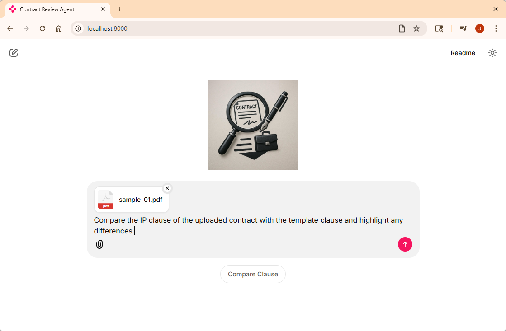

# Lab 2: Create your first agent

## Learning Objectives

1. Create a Search Plugin for our agent to retrieve contract clauses from the Search index
2. Create an ChatCompletionAgent
3. Wire it up to Chainlit

## Prerequisites

1. Lab 0 is required to have the development environment configured and all dependencies installed
2. If you've got a populated Azure AI Search index, Lab 1 is optional. However this lab was designed to follow Lab 1.

## What type of Agents?

In the remaining labs we will be utilizing [Semantic Kernel](https://github.com/microsoft/semantic-kernel/) for an agent framework. The [documentation](https://learn.microsoft.com/en-us/semantic-kernel/frameworks/agent/?pivots=programming-language-python) and [source code](https://github.com/microsoft/semantic-kernel/tree/main/python/samples/getting_started_with_agents) for Semantic Kernel give you a lot of tools to use. For this workshop we will mainly be using the [ChatCompletionAgent](https://learn.microsoft.com/en-us/semantic-kernel/frameworks/agent/agent-types/chat-completion-agent?pivots=programming-language-python). As you'll see, you can do quite a bit with just this one agent type and plugins. The [Agent Architecture](https://learn.microsoft.com/en-us/semantic-kernel/frameworks/agent/agent-architecture?pivots=programming-language-python) page covers what we need to implement our use cases.

 What we will need for this first agent:
- a **prompt** - we'll use a prompty template to store the instructions we'll give the agent
- an **LLM** api to call
- a **plugin** (aka a tool) that will interact with the Azure AI Search service
- wire up to Chainlit for an orchestrator of sorts

## Create a Search Plugin for our agent to retrieve contract clauses from the Search index

1. In VS Code, add an **agents** folder to the src folder and create a subfolder named **plugins**. 
2. Create a new file named **search_plugin.py** in that folder and add the following contents to that file:
```
from semantic_kernel.functions import kernel_function

class SearchPlugin:
    """A plugin for searching."""

    def __init__(self, search_service):
        self.search_service = search_service

    @kernel_function(name="search_for_clause_in_uploadedcontract", description="Search for a clause in the uploaded contract based on the search text and return the full clause text.")
    async def search_for_clause_in_uploaded_contract(self, search_text: str, uploaded_contract_filename: str) -> str:
        print(f"Searching for clause in uploaded contract: {uploaded_contract_filename} with search text: {search_text}")

        uploaded_contract_clause = await self.search_service.search_single_hybrid(query=search_text, filter=f"doc_id eq '{uploaded_contract_filename}'")
        if not uploaded_contract_clause:
            return "No matching clause found in the uploaded document. Please try another clause."
        return uploaded_contract_clause.text_full
```
This logic create a plugin class, which uses the search_service to do the work. There is only one method right now `search_for_clause_in_uploaded_contract`. This method is marked for semantic kernel to recognize it as a plugin. If you take a look at the contents, it simply wraps a call to the search_service to make a hybrid search. This will allow us to search for a contract clause by either keyword or semantic meaning and return the most relevant one.

## Create an ChatCompletionAgent
1. In VS Code, find the **agents** folder and add a new file named **compare_clause_agent.py**
2. Add the following at the top of that file:
```
from azure.identity import DefaultAzureCredential
from semantic_kernel.agents import ChatCompletionAgent
from semantic_kernel.connectors.ai.open_ai import AzureChatCompletion

from agents.plugins.search_plugin import SearchPlugin
from processors.document_processor import DocumentProcessor
```
Thes are the imports we'll need.

3. Next add the following:
```
def get_compare_clause_agent(processor: DocumentProcessor) -> ChatCompletionAgent:
    compare_prompt = processor.prompt_service.load_prompt("compare_contract.prompty")
    instructions = processor.prompt_service.render_prompt_as_string(compare_prompt, {
        "desired_terms": processor.desired_terms,
    })

    agent = ChatCompletionAgent(
        service=AzureChatCompletion(credential=DefaultAzureCredential()),
        name="compare_contract",
        description="Compare the entire uploaded contract with the template and highlight any differences.",
        instructions=instructions,
        plugins=[SearchPlugin(processor.search_service)],
    )
    return agent
```
This code first loads the `compare_contract.prompty` file from the **prompts** folder. Feel free to take a look at it and modify it however you want. The prompt is shown below:

```
---
name: Compare Clause
description: Compare a clause to the template and provide an analysis for legal review
model:
    api: chat
    configuration:
        type: azure_openai
        azure_endpoint: ${env:AZURE_OPENAI_ENDPOINT}
        azure_deployment: ${env:AZURE_OPENAI_CHAT_DEPLOYMENT_NAME}
        api_version: 2024-12-01-preview
sample:
    desired_terms: "All deliverables and work products created by the Consultant in connection with the services shall be the sole and exclusive property of the Client."
---
system:
# Contract Clause Comparison and Risk Assessment

## Instructions
You are a legal analysis assistant tasked with comparing contract clauses. When a user provides an uploaded contract clause, template clause, and desired terms, analyze them systematically to identify risks and deviations.

**Desired Terms**: {desired_terms}

## Analysis Framework

### 1. Clause Comparison
Compare the uploaded clause against the template:
- Identify missing or additional provisions
- Highlight key terminology differences
- Note variations in legal standards, scope, or conditions

### 2. Desired Terms Assessment
- Mark which desired terms are satisfied, partially met, or missing
- Assess business impact of gaps
- Evaluate enforceability concerns

### 3. Risk Categorization
**High Risk**: Significant liability exposure, missing critical protections, unclear enforcement terms
**Medium Risk**: Minor deviations, operational complications, additional compliance requirements  
**Low Risk**: Stylistic differences with minimal legal impact

## Output Format

### Executive Summary
Provide a brief overview of key findings and overall risk level.

### Key Findings
- **Critical Issues**: High-risk items requiring immediate attention
- **Negotiation Points**: Medium-risk items for discussion  
- **Minor Notes**: Low-risk observations for awareness

### Desired Terms Status
- ✅ **Satisfied**: Terms that are fully met
- ⚠️ **Gaps**: Terms with issues and recommendations
- ❌ **Missing**: Absent terms and their impact

### Recommendations
Provide specific, actionable next steps prioritized by urgency.

## Guidelines
- Focus on legal substance over style
- Highlight unexpected obligations or risks
- Consider enforceability and business impact
- Be specific and actionable in findings
```

The prompt has one argument `desired_terms`, which we load in a reference file that has a listing of all the contract terms we prefer (again, feel free to make this file your own). 

The rest of the code declares the `ChatCompletionAgent` agent, sets the LLM to be the `AzureChatCompletion()`, gives it a name, description, the instructions from above and adds the `SearchPlugin` for the agent to use.

> NOTE: the `AzureChatCompletion` uses the default environment variables - that is why you don't see any endpoint or credential setting here.
>
> Also notice the name uses and underscore ... not a hyphen or space. The name must match the regex pattern `'^[0-9A-Za-z]+$'` or it will fail.

That is it, we can now wire it up to Chainlit.

## Wire it up to Chainlit

1. In the **main.py** file, toward the top - find the comment `# TODO: Add the get_compare_clause_agent import here` and replace it with the following:
```
from agents.compare_clause_agent import get_compare_clause_agent
```
2. In the `on_chat_start` method, find the comment `# TODO: Agents will be added here later` and replace it with the following:
```
    agent = get_compare_clause_agent(processor)
    cl.SemanticKernelFilter(kernel=agent.kernel)
    cl.user_session.set("agent", agent)
```
This creates an instance of the agent we just defined and wires it up to Chainlit to be used when you interact with Chainlit

3. Later in the **main.py** file, look for the comment `on_message` method and replace it with the following:
```
async def on_message(message: cl.Message):
    """Handle incoming messages."""
    agent = cl.user_session.get("agent")
    thread = cl.user_session.get("thread", None)

    # Check if there are files attached to the message
    if message.elements:
        await cl.Message(content="Processing your uploaded files...").send()
        await process_files(message.elements)
    else:
        await cl.Message(content="No files uploaded. Please attach a file using the paperclip icon.").send()

    current_filename = cl.user_session.get("filename", "sample-01.pdf") # Hardcoded for debugging
    
    message = f"Using your plugins and the uploaded contract {current_filename}, perform the following: {message.content}"
    
    await stream_agent_response(
        agent=agent, 
        thread=thread, 
        answer=cl.Message(content=""), 
        message=message
    )

async def stream_agent_response(agent: ChatCompletionAgent, thread: AgentThread, answer: cl.Message, message: str):
    """Stream the agent's response."""

    async for response in agent.invoke_stream(messages=message, thread=thread):
        content = getattr(getattr(response, "content", None), "content", None)
        if content:
            await answer.stream_token(content)
        thread = getattr(response, "thread", thread)
    
    await answer.update()
    cl.user_session.set("thread", thread)
    await answer.send()
```
This added a few things:
- setting of the agent and thread variables from teh session if they exist
- created a variable `current_filename` for debugging, this is so you don't have to keep uploading the same file later
- setting of the **message** variable for the agent
- added the streaming messages from the agent

4. Toward the top of the **main.py** file, find the comment `# TODO: Add starters` and replace it with:
```
@cl.set_starters
async def set_starters():
    """Set starters for the chat."""
    return [
        cl.Starter(
            label="Compare Clause",
            message="Compare the IP clause of the uploaded contract with the template clause and highlight any differences."
        )
    ]
```

You are now ready to test it.

## Test it

1. You have two choices here: run it in the debugger or just run it from the terminal:

- To run from the debugger, Go to Run menu -> Start debugging
- To run from command line, run
```
chainlit run main.py
```
2. In VS Code, right click on the **data** directory and select **Reveal in File Explorer**.
3. In the Chainlit UI, click on the **paperclip icon** and choose the **sample-01.pdf** file from the **data** directory, type the text **Compare the IP clause of the uploaded contract with the template clause and highlight any differences.** and click the send button.

> Note: we added a starter button, so going forward you can just click on it.



Once the file uploads it will then run the agent and compare the clause for you.


Congratulations, you now created an agent!