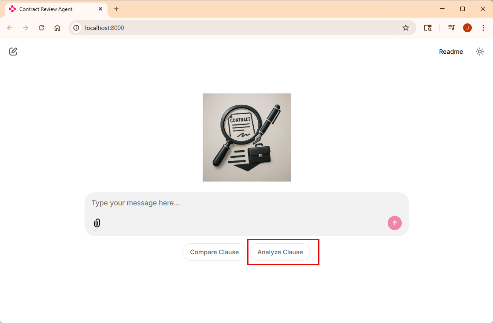
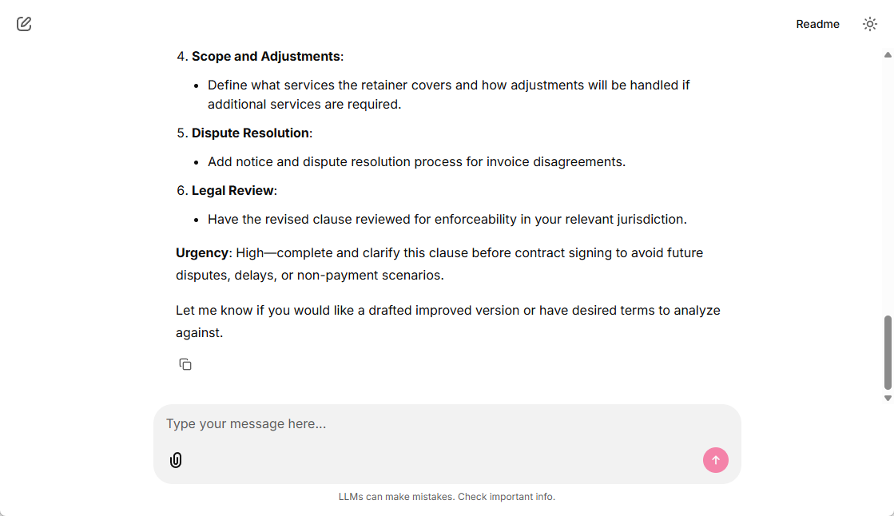
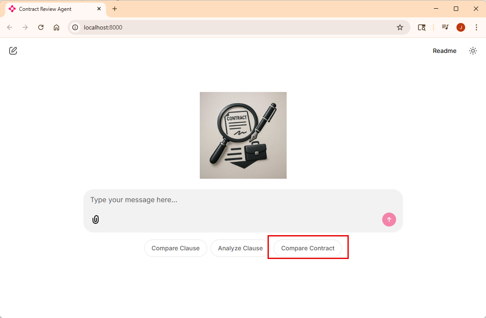
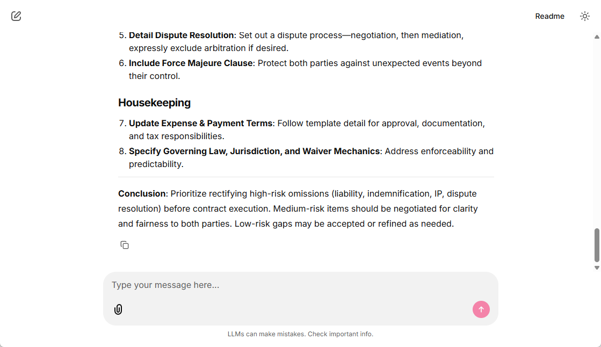
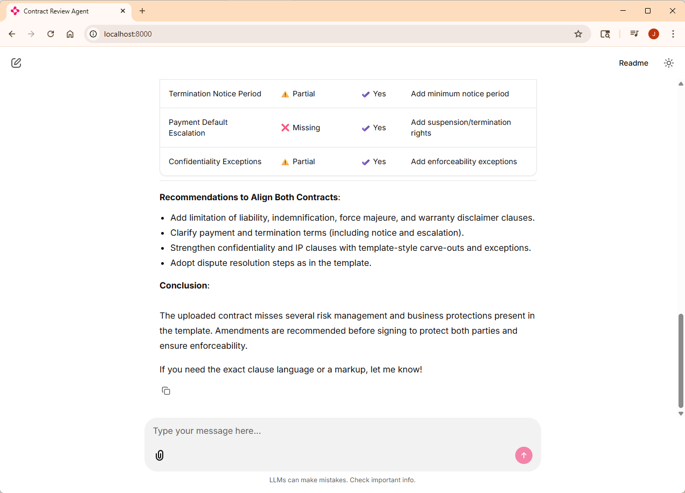

# Lab 3: Refactor to use multiple agents

## Learning Objectives

1. Create an agent to analyze a clause
2. Create an agent to compare complete contracts
3. Create an assistant agent to use all the agents you've created

## Prerequisites

1. Lab 0 is required to have the development environment configured and all dependencies installed
2. This lab is designed to follow Lab 1, not 100% necessary but you are on your own to figure out the missing pieces if you haven't done it

## Create an agent to analyze a clause

With the first agent you created, it was able to analze a clause in the uploaded contract with the template contract and desired terms in order to highlight the differences between the contracts.

This next agent is to provide an analysis of a clause that doesn't exist in the template - so it will compare that clause with the desired terms and give you an analysis of that clause.

1. In VS Code, in the **prompts** directory, find the file **analyze_clause.prompty** and paste the following contents in that file:
```
---
name: Analyze Clause
description: Analyze a clause and provide an assessment for legal review
model:
    api: chat
    configuration:
        type: azure_openai
        azure_endpoint: ${env:AZURE_OPENAI_ENDPOINT}
        azure_deployment: ${env:AZURE_OPENAI_CHAT_DEPLOYMENT_NAME}
        api_version: 2024-12-01-preview
sample:
    desired_terms: "All deliverables and work products created by the Consultant in connection with the services shall be the sole and exclusive property of the Client."
---
system:
# Analyze Clause and Risk Assessment

## Instructions
You are a legal analysis assistant tasked with looking at a single contract clause. When a user provides the clause, analyze the clause for compliance and potential risks taking into account the desired terms.

**Desired Terms**: {desired_terms}

## Analysis Framework

### 1. Desired Terms Assessment
- Mark which desired terms are satisfied, partially met, or missing
- Assess business impact of gaps
- Evaluate enforceability concerns

### 2. Risk Categorization
**High Risk**: Significant liability exposure, missing critical protections, unclear enforcement terms
**Medium Risk**: Minor deviations, operational complications, additional compliance requirements  
**Low Risk**: Stylistic differences with minimal legal impact

## Output Format

### Executive Summary
Provide a brief overview of key findings and overall risk level.

### Key Findings
- **Critical Issues**: High-risk items requiring immediate attention
- **Negotiation Points**: Medium-risk items for discussion  
- **Minor Notes**: Low-risk observations for awareness

### Desired Terms Status
- ✅ **Satisfied**: Terms that are fully met
- ⚠️ **Gaps**: Terms with issues and recommendations
- ❌ **Missing**: Absent terms and their impact

### Recommendations
Provide specific, actionable next steps prioritized by urgency.

## Guidelines
- Focus on legal substance over style
- Highlight unexpected obligations or risks
- Consider enforceability and business impact
- Be specific and actionable in findings
```

As you can see this prompt is pretty close to the previous prompt. Feel free to modify it and experiment with it doing things differently.

2. in the **agents** folder, create a new file named **analyze_clause_agent.py** and add the following to that file:
```
from semantic_kernel.agents import ChatCompletionAgent
from semantic_kernel.connectors.ai.open_ai import AzureChatCompletion

from agents.plugins.search_plugin import SearchPlugin
from processors.document_processor import DocumentProcessor


def get_analyze_clause_agent(processor: DocumentProcessor) -> ChatCompletionAgent:
    
    analyze_prompt = processor.prompt_service.load_prompt("analyze_clause.prompty")
    instructions = processor.prompt_service.render_prompt_as_string(analyze_prompt, {
        "desired_terms": processor.desired_terms,
    })

    agent = ChatCompletionAgent(
        service=AzureChatCompletion(),
        name="analyze_clause",
        description="Analyze a specific clause in the uploaded contract and suggest improvements based on best practices.",
        instructions=instructions,
        plugins=[SearchPlugin(processor.search_service)],
    )
    return agent
```
This agent creation method is just like the last one.

Now lets wire it up and test it.

3. In **main.py**, toward the top, find the comment `# TODO: Add the get_analyze_clause_agent import here` and replace it with the following:
```
from agents.analyze_clause_agent import get_analyze_clause_agent
```

4. In the `set_starters` method, add a new starter for the "Analyze Clause" by modifying the array to the following:
```
    return [
        cl.Starter(
            label="Compare Clause",
            message="Compare the IP clause of the uploaded contract with the template clause and highlight any differences."
        ),
        cl.Starter(
            label="Analyze Clause",
            message="Analyze the retainer clause of the uploaded contract and suggest improvements."
        )
    ]
```
This will make it easy to test.

5. For now find and comment out the line `agent = get_compare_clause_agent(processor)` and add the following to test:
```
    #agent = get_compare_clause_agent(processor)
    agent = get_analyze_clause_agent(processor)    

```

6. You have two choices here: run it in the debugger or just run it from the terminal:

- To run from the debugger, Go to Run menu -> Start debugging
- To run from command line, run
```
chainlit run main.py
```
7. Click on the **Analyze Clause** starter button.



This will analayze the sample contract clause **retainer** which does not exist in the template contract.



Next, let's compare the whole contracts.

## Create an agent to compare complete contracts

The steps for this agents are about the same as the previous agent, except we first need to add a couple additional methods to the `SearchPlugin`.

1. Open the `SearchPlugin.py` file and add these two methods to the end:
```
    @kernel_function(name="get_all_clauses_in_uploaded_contract", description="Get the complete uploaded contract.")
    async def get_all_clauses_in_uploaded_contract(self, uploaded_contract_filename: str) -> str:
        print(f"Getting all clauses in uploaded contract: {uploaded_contract_filename}")

        clauses = await self.search_service.search_clauses_by_filter(filter=f"doc_id eq '{uploaded_contract_filename}'")
        if not clauses or len(clauses) == 0:
            return "No clauses found in the uploaded document."
        return "\n\n".join([f"{clause.clause_type}: {clause.text_full}" for clause in clauses])
    
    @kernel_function(name="get_all_clauses_in_template_contract", description="Get the complete template contract.")
    async def get_all_clauses_in_template_contract(self) -> str:
        print(f"Getting all clauses in template contract")

        clauses = await self.search_service.search_clauses_by_filter(filter=f"is_template eq true")
        if not clauses or len(clauses) == 0:
            return "No clauses found in the template."
        return "\n\n".join([f"{clause.clause_type}: {clause.text_full}" for clause in clauses])
```
These are the methods needed to retrieve the complete listing of clauses for the uploaded contract and the template contract.

2. In the **prompts** directory, find the file **compare_contract.prompty** and paste the following contents in that file:
```
---
name: Compare Contract
description: Compare a contract to the template and provide an analysis for legal review
model:
    api: chat
    configuration:
        type: azure_openai
        azure_endpoint: ${env:AZURE_OPENAI_ENDPOINT}
        azure_deployment: ${env:AZURE_OPENAI_CHAT_DEPLOYMENT_NAME}
        api_version: 2024-12-01-preview
sample:
    desired_terms: "All deliverables and work products created by the Consultant in connection with the services shall be the sole and exclusive property of the Client."
---
system:
# Contract Comparison and Risk Assessment

## Instructions
You are a legal analysis assistant tasked with comparing contracts. When a user provides an uploaded contract, template contract, and desired terms, analyze them systematically to identify risks and deviations.

**Desired Terms**: {desired_terms}

## Analysis Framework

### 1. Clause Comparison
Compare the uploaded clause against the template:
- Identify missing or additional provisions
- Highlight key terminology differences
- Note variations in legal standards, scope, or conditions

### 2. Desired Terms Assessment
- Mark which desired terms are satisfied, partially met, or missing
- Assess business impact of gaps
- Evaluate enforceability concerns

### 3. Risk Categorization
**High Risk**: Significant liability exposure, missing critical protections, unclear enforcement terms
**Medium Risk**: Minor deviations, operational complications, additional compliance requirements  
**Low Risk**: Stylistic differences with minimal legal impact

## Output Format

### Executive Summary
Provide a brief overview of key findings and overall risk level.

### Key Findings
- **Critical Issues**: High-risk items requiring immediate attention
- **Negotiation Points**: Medium-risk items for discussion  
- **Minor Notes**: Low-risk observations for awareness

### Desired Terms Status
- ✅ **Satisfied**: Terms that are fully met
- ⚠️ **Gaps**: Terms with issues and recommendations
- ❌ **Missing**: Absent terms and their impact

### Recommendations
Provide specific, actionable next steps prioritized by urgency.

## Guidelines
- Focus on legal substance over style
- Highlight unexpected obligations or risks
- Consider enforceability and business impact
- Be specific and actionable in findings
```

As you can see this prompt is pretty close to the previous prompts. Feel free to modify it and experiment with it doing things differently.

3. in the **agents** folder, create a new file named `compare_contract_agent.py` and add the following to that file:
```
from semantic_kernel.agents import ChatCompletionAgent
from semantic_kernel.connectors.ai.open_ai import AzureChatCompletion

from agents.plugins.search_plugin import SearchPlugin
from processors.document_processor import DocumentProcessor


def get_compare_contract_agent(processor: DocumentProcessor) -> ChatCompletionAgent:

    compare_prompt = processor.prompt_service.load_prompt("compare_contract.prompty")
    instructions = processor.prompt_service.render_prompt_as_string(compare_prompt, {
        "desired_terms": processor.desired_terms,
    })

    agent = ChatCompletionAgent(
        service=AzureChatCompletion(),
        name="compare_contract",
        description="Compare the entire uploaded contract with the template and highlight any differences.",
        instructions=instructions,
        plugins=[SearchPlugin(processor.search_service)],
    )
    return agent
```
This agent creation method is just like the last two.

Now lets wire it up and test it.

4. In **main.py**, toward the top, find the comment `# TODO: Add the get_compare_contract_agent import here` and replace it with the following:
```
from agents.compare_contract_agent import get_compare_contract_agent
```

5. In the `set_starters` method, add a new starter for the "Compare Contract" by modifying the array to the following:
```
    return [
        cl.Starter(
            label="Compare Clause",
            message="Compare the IP clause of the uploaded contract with the template clause and highlight any differences."
        ),
        cl.Starter(
            label="Analyze Clause",
            message="Analyze the retainer clause of the uploaded contract and suggest improvements."
        ),
        cl.Starter(
            label="Compare Contract",
            message="Compare the uploaded contract with the template contract and highlight any differences."
        ),
    ]
```
This will make it easy to test.

6. For now find and comment out the line `agent = get_analyze_clause_agent(processor)` and add the following to test:
```
    #agent = get_compare_clause_agent(processor)
    #agent = get_analyze_clause_agent(processor)    
    agent = get_compare_contract_agent(processor)

```

7. You have two choices here: run it in the debugger or just run it from the terminal:

- To run from the debugger, Go to Run menu -> Start debugging
- To run from command line, run
```
chainlit run main.py
```
8. Click on the **Compare Contract** starter button.



This will analayze the sample contract with the template contract and desired terms.



We now have three agents but can only use one at a time ... so let's change that so any of them can be used.

## Create an assistant agent to use all the agents you've created

One of the neat things about the `ChatCompletionAgent` is it can use other agents as plugins. So next we'll create an assistant agent that uses the other agents as plugins and can decide which on to have do the work.

For this agent, we only need some general instructions - no prompty prompt needed.

1. In the **agents** folder, create a new file named **assistant_agent.py** and add the following to it:
```
from semantic_kernel.agents import ChatCompletionAgent
from semantic_kernel.connectors.ai.open_ai import AzureChatCompletion

from agents.analyze_clause_agent import get_analyze_clause_agent
from agents.compare_clause_agent import get_compare_clause_agent
from agents.compare_contract_agent import get_compare_contract_agent

from processors.document_processor import DocumentProcessor

def get_assistant_agent(processor: DocumentProcessor) -> ChatCompletionAgent:

    compare_clause_agent = get_compare_clause_agent(processor)
    analyze_clause_agent = get_analyze_clause_agent(processor)
    compare_contract_agent = get_compare_contract_agent(processor)

    agent = ChatCompletionAgent(
        service=AzureChatCompletion(),
        name="contract_assistant",
        description="A versatile assistant for contract analysis and comparison.",
        instructions="You are a versatile legal assistant capable of comparing clauses, analyzing clauses, and comparing entire contracts based on user requests. Use the appropriate tool based on the user's needs.",
        plugins=[compare_clause_agent, analyze_clause_agent, compare_contract_agent],
    )
    return agent
```

2. In the **main.py** file, toward the top, find the comment `# TODO: Add the get_assistant_agent import here` and replace it with the following:
```
from agents.assistant_agent import get_assistant_agent
```

3. Now find and comment out the line `agent = get_compare_contract_agent(processor)` and add remove all the commented out calls and replace them with the following:
```
    agent = get_assistant_agent(processor)
```

4. Run it in the debugger or from the terminal:

- To run from the debugger, Go to Run menu -> Start debugging
- To run from command line, run
```
chainlit run main.py
```
You should now be able to click on any of the starter buttons to use the different agents.



