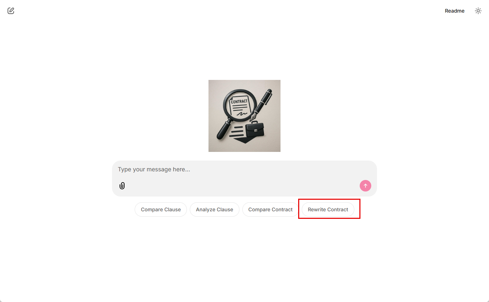

# Lab 4: Doc Gen with a plugin

## Learning Objectives

1. Create a DocGen plugin to create a word document
3. Create agents for a two phase process
4. Wire up Chainlit to test

## Prerequisites

1. [Lab 0](../lab0/readme.md) is required to have the development environment configured and all dependencies installed
2. This lab is designed to follow Lab 3, not 100% necessary but you are on your own to figure out the missing pieces if you haven't done it

## Create a DocGen plugin to create a word document

1. In VS Code, in the **plugins** folder, create a new file named **doc_gen_plugin.py** and add the following:
```python
from semantic_kernel.functions import kernel_function

class DocGenPlugin:
    """A plugin for generating documents."""

    def __init__(self, document_service):
        self.document_service = document_service

    @kernel_function(name="create_document", description="Create a new Word document with optional metadata.")
    async def create_document(self, filename: str, title: str, author: str) -> str:
        
        print(f"Creating document: {filename}, title: {title}, author: {author}")
        
        return await self.document_service.create_document(filename, title, author)

    @kernel_function(name="add_section", description="Adds a heading and list of strings as paragraphs to a Word document.")
    async def add_section(self, filename: str, heading: str, heading_level: int, paragraphs: list[str]) -> str:

        print(f"Adding section to document: {filename}, heading: {heading}, paragraphs: {paragraphs}")

        await self.document_service.add_heading(filename, heading, heading_level)
        for paragraph in paragraphs:
            await self.document_service.add_paragraph(filename, paragraph)
        
        return f"Section '{heading}' added to document '{filename}'."

    @kernel_function(name="add_heading", description="Add a heading to a Word document.")
    async def add_heading(self, filename: str, text: str, level: int) -> str:
        
        print(f"Adding heading to document: {filename}, text: {text}, level: {level}")  
        
        return await self.document_service.add_heading(filename, text, level)
    
    @kernel_function(name="add_paragraph", description="Add a paragraph to a Word document.")
    async def add_paragraph(self, filename: str, text: str) -> str:
        
        print(f"Adding paragraph to document: {filename}, text: {text}")

        return await self.document_service.add_paragraph(filename, text)
``` 
This provides a plugin to wrap the `document_service` functionality to provide the agent the ability to create word documents and modify them.


## Create agents for a two phase process

We now want to create two agents:
- an agent that analyzes the uploaded contract and the template to determine what should modified
- an agent that uses the `DocGenPlugin` to create the document, then provide a download link to download the new contract

We'll define both in the same file.

1. In the **agents** folder, create a new file named **rewrite_contract_agent.py** and add the following:
```
from semantic_kernel import Kernel
from semantic_kernel.agents import ChatCompletionAgent
from semantic_kernel.connectors.ai.open_ai import AzureChatCompletion

from agents.plugins.doc_gen_plugin import DocGenPlugin
from agents.plugins.search_plugin import SearchPlugin
from processors.document_processor import DocumentProcessor

def get_rewrite_analysis_agent(processor: DocumentProcessor, kernel: Kernel) -> ChatCompletionAgent:

    rewrite_analysis_prompt = processor.prompt_service.load_prompt("rewrite_contract_analysis.prompty")
    instructions = processor.prompt_service.render_prompt_as_string(rewrite_analysis_prompt, {
        "desired_terms": processor.desired_terms,
    })
    
    agent = ChatCompletionAgent(
        service=AzureChatCompletion(),
        name="rewrite_analysis_contract",
        description="Analyze the contracts to prepare to rewrite the contract.",
        instructions=instructions,
        kernel=kernel,
        plugins=[SearchPlugin(processor.search_service)],
    )
    return agent

def get_rewrite_contract_agent(processor: DocumentProcessor, kernel: Kernel) -> ChatCompletionAgent:

    rewrite_rewrite_prompt = processor.prompt_service.load_prompt("rewrite_contract_rewrite.prompty")
    instructions = processor.prompt_service.render_prompt_as_string(rewrite_rewrite_prompt, {
        "desired_terms": processor.desired_terms,
    })
    
    agent = ChatCompletionAgent(
        service=AzureChatCompletion(),
        name="rewrite_rewrite_contract",
        description="Rewrite the contract using the style of the uploaded contract, rewrite the entire document based on the template and desired terms using the word document plugin to create a word file.",
        instructions=instructions,
        kernel=kernel,
        plugins=[DocGenPlugin(processor.document_service)],
    )
    return agent
```

2. Modify the **assistant_agent.py** file to match the following:
```
from semantic_kernel import Kernel
from semantic_kernel.agents import ChatCompletionAgent
from semantic_kernel.connectors.ai.open_ai import AzureChatCompletion

from agents.analyze_clause_agent import get_analyze_clause_agent
from agents.compare_clause_agent import get_compare_clause_agent
from agents.compare_contract_agent import get_compare_contract_agent
from agents.rewrite_contract_agent import get_rewrite_analysis_agent, get_rewrite_contract_agent

from processors.document_processor import DocumentProcessor

def get_assistant_agent(processor: DocumentProcessor) -> ChatCompletionAgent:
    
    compare_clause_agent = get_compare_clause_agent(processor)
    analyze_clause_agent = get_analyze_clause_agent(processor)
    compare_contract_agent = get_compare_contract_agent(processor)

    kernel = Kernel()
    analysis_agent = get_rewrite_analysis_agent(processor, kernel)
    rewrite_agent = get_rewrite_contract_agent(processor, kernel)
    
    agent = ChatCompletionAgent(
        service=AzureChatCompletion(),
        name="contract_assistant",
        description="A versatile assistant for contract analysis and comparison.",
        instructions="You are a versatile legal assistant capable of comparing clauses, analyzing clauses, comparing entire contracts and rewriting contracts based on user requests. Use the appropriate tool based on the user's needs.",
        kernel=kernel,
        plugins=[compare_clause_agent, analyze_clause_agent, compare_contract_agent, analysis_agent, rewrite_agent],
    )
    return agent
```
The following items changed:
- added an import for `Kernel`
- added imports for `get_rewrite_analysis_agent, `get_rewrite_contract_agent`
- created a Kernel instance to share bewteen the rewrite agents
- added `analysis_agent` and 'rewrite_agent' to the list of plugins

## Wire up Chainlit to test

1. In **main.py**, find the comment toward the top '# TODO: Add kernel_function import here' and replace it with the following:
```
from semantic_kernel.functions import kernel_function
``` 

2. Find the comment `# TDDO: Add CreateFileDownloadPlugin here` and add a plugin class for creating a file download link:
```
class CreateFileDownloadPlugin:
    """A plugin to create a file download link."""

    def __init__(self, message: cl.Message = None):
        self.message = message

    @kernel_function(name="create_chainlit_file_download", description="Create a Chainlit file download link for the given filename.")
    async def create_file_download(self, filename: str) -> cl.File:
        """Create a file download link for the given filename."""
        
        elements = [ 
            cl.File(
                name=filename,
                path=filename,
                display="inline"
            )
        ]
        if self.message:
             await cl.Message(
                content="File Link", elements=elements
            ).send()
```
The system will use this once the contract file has been created.

3. In **main.py** add a new starter to the `set_starters` return, so the array now looks like:
```
    return [
        cl.Starter(
            label="Compare Clause",
            message="Compare the IP clause of the uploaded contract with the template clause and highlight any differences."
        ),
        cl.Starter(
            label="Analyze Clause",
            message="Analyze the retainer clause of the uploaded contract and suggest improvements."
        ),
        cl.Starter(
            label="Compare Contract",
            message="Compare the uploaded contract with the template contract and highlight any differences."
        ),
        cl.Starter(
            label="Rewrite Contract",
            message="Analyze the uploaded contract with the template contract and rewrite a new version of the contract that combines the best clauses from both contracts into a new contract."
        )
    ]
```
This will add a button for the "Rewrite Contract"

4. Replace the line with to `get_assistant_agent` to the following:
```
    agent = get_assistant_agent(processor)
    agent.kernel.add_plugin(CreateFileDownloadPlugin(cl.Message(content="")))
```
Notice this adds the file download plugin to the kernel Chainlit is keeping track of.

5. Run it in the debugger or from the terminal:

- To run from the debugger, Go to Run menu -> Start debugging
- To run from command line, run
```
chainlit run main.py
```
Click on the "Rewrite Contract" starter button to test the functionality



You should see the plugin activity show and a link to download the file:


### Known Issue
If you see the output get *stuck* like this:


Type **continue** and click the **send** button. This should get it going again.

Once the download link shows, you should be able to open the Word document (assuming you have an application that will open a .docx file).

